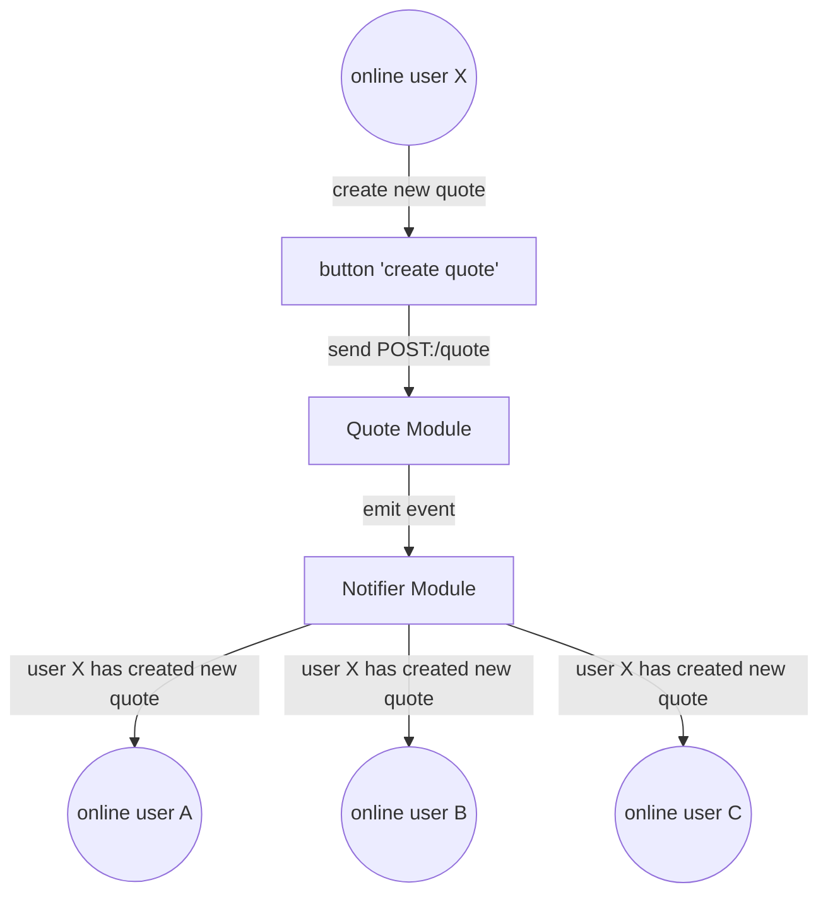
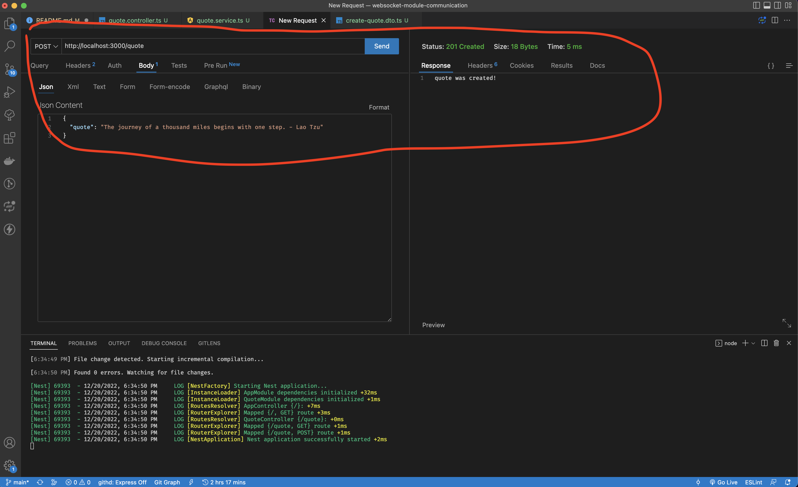
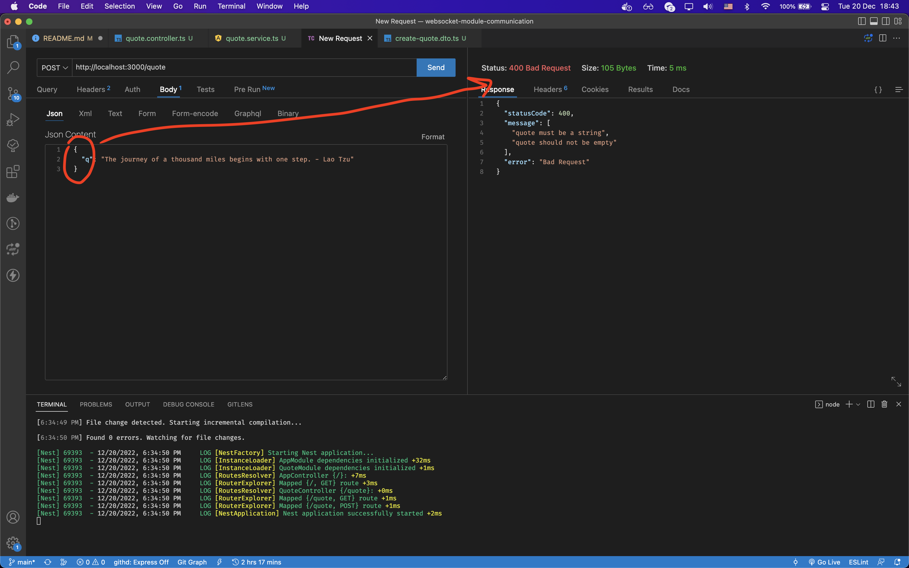
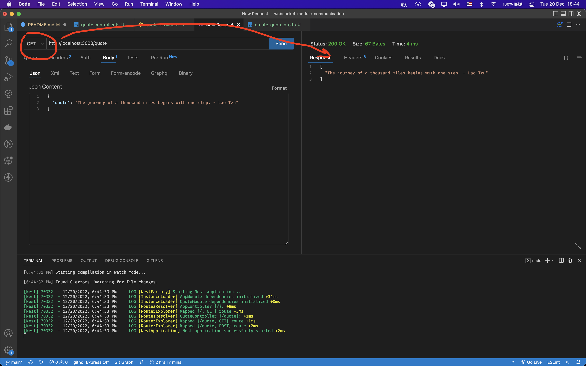
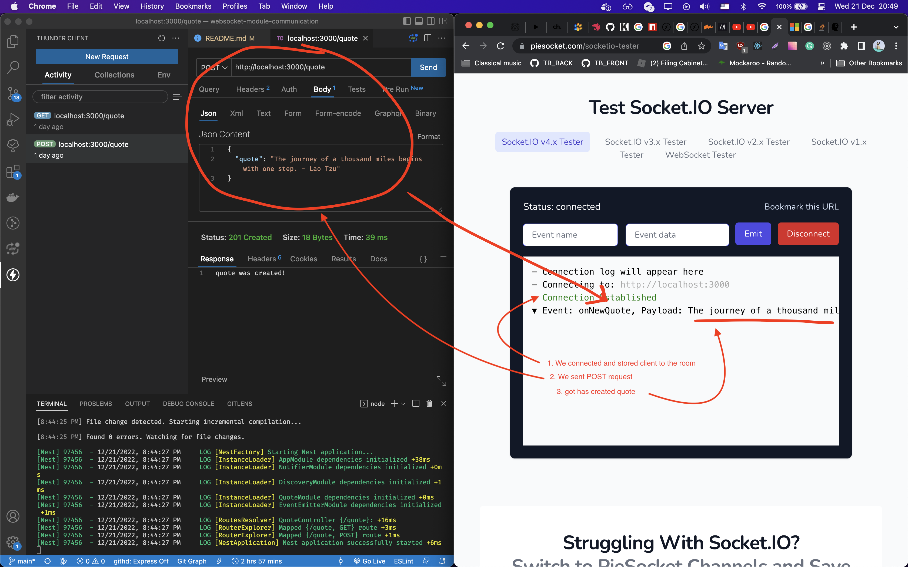

# How to implement communication between modules using websocket in NestJS

### Preparation

#### Generate new project using nest cli
before you need to install global package nest and create new project.
```
npm i -g @nestjs/cli
nest new websocket-module-communication
```
We got following file structure:
```bash
websocket-module-communication/
├── node_modules/
├── src/
├── test/
├── .eslintrc.js
├── .gitignore
├── .prettierrc
├── nest-cli.json
├── package.json
├── package-lock.json
├── README.md
├── tsconfig.build.md
└── tsconfig.json
```

#### install packages to work with websocket
use command
```bash
# websocket
npm i --save @nestjs/websockets @nestjs/platform-socket.io
# validation of request
npm i --save class-validator class-transformer

```

##### What do we want to do?

We have a module `Quote` for creating and receiving quotes. 
It works via `HTTP` and has two methods, `GET` to get all quotes and `POST` to create a quote.

Another module `Notifier` to notify all online users  when a new quote is created by someone. It works via `WebSocket`.


**The purpose of this tutorial is to show how to make a communication between `Quote` and `Notifier`.**

##### HTTP Module
Let's create our modules:
```bash
# create module
❯ nest g module quote
CREATE src/quote/quote.module.ts (82 bytes)
UPDATE src/app.module.ts (312 bytes)
# create controller
❯ nest g co quote    
CREATE src/quote/quote.controller.spec.ts (485 bytes)
CREATE src/quote/quote.controller.ts (99 bytes)
UPDATE src/quote/quote.module.ts (170 bytes)
# create service
❯ nest g s quote 
CREATE src/quote/quote.service.spec.ts (453 bytes)
CREATE src/quote/quote.service.ts (89 bytes)
UPDATE src/quote/quote.module.ts (247 bytes)
```
Update your controller and service:
```typescript
// src/quote/quote.controller.ts
import {
  Body,
  Controller,
  Get,
  InternalServerErrorException,
  Post,
  UsePipes,
  ValidationPipe,
} from '@nestjs/common';
import { QuoteService } from './quote.service';
import { CreateQuoteDto } from './dtos/create-quote.dto';

@Controller('quote')
export class QuoteController {
  constructor(private readonly quoteService: QuoteService) {}
  @Get()
  async getAllQuotes() {
    try {
      return await this.quoteService.allQuotes();
    } catch (error) {
      throw new InternalServerErrorException(error.message);
    }
  }

  @Post()
  @UsePipes(new ValidationPipe({ transform: true }))
  async createQuote(@Body() createQuoteDto: CreateQuoteDto) {
    try {
      const { quote } = createQuoteDto;
      await this.quoteService.createQuote(quote);
      return 'quote was created!';
    } catch (error) {
      throw new InternalServerErrorException(error.message);
    }
  }
}
```
```typescript
// src/quote/quote.service.ts
import { Injectable } from '@nestjs/common';

@Injectable()
export class QuoteService {
  private readonly quotes: string[] = [];

  async allQuotes() {
    return this.quotes;
  }

  async createQuote(quote: string) {
    this.quotes.push(quote);
  }
}
```

also you need create classDto for validation POST request.
```typescript
// src/quote/dtos/create-quote.dto.ts
import { IsNotEmpty, IsString } from 'class-validator';

export class CreateQuoteDto {
  @IsNotEmpty()
  @IsString()
  quote: string;
}
```
Great! Now check it.
You should see like these:

**POST create new quote**


**POST invalid request**


**GET all quotes**


##### WebSocket Module
Next, we should create module for all online users.
```bash
❯ nest g mo notifier 
CREATE src/notifier/notifier.module.ts (85 bytes)
UPDATE src/app.module.ts (389 bytes)

❯ nest g ga notifier/notifier
CREATE src/notifier/notifier.gateway.spec.ts (474 bytes)
CREATE src/notifier/notifier.gateway.ts (242 bytes)
UPDATE src/notifier/notifier.module.ts (171 bytes)
```

install package for communication between modules
```bash
npm i --save @nestjs/event-emitter
```
and update app.module.ts
```typescript
import { Module } from '@nestjs/common';
import { AppController } from './app.controller';
import { AppService } from './app.service';
import { QuoteModule } from './quote/quote.module';
import { NotifierModule } from './notifier/notifier.module';
import { NotifierGateway } from './notifier/notifier.gateway';
import { EventEmitterModule } from '@nestjs/event-emitter';

@Module({
  imports: [QuoteModule, NotifierModule, EventEmitterModule.forRoot()],
  controllers: [AppController],
  providers: [AppService, NotifierGateway],
})
export class AppModule {}
```

you you need update two files `notifier.gateway.ts`  
```typescript
// src/notifier/notifier.gateway.ts
import { OnModuleInit } from '@nestjs/common';
import {
  WebSocketGateway,
  WebSocketServer,
  WsException,
} from '@nestjs/websockets';
import { Server } from 'socket.io';
import { OnEvent } from '@nestjs/event-emitter';

type QuoteCreatedEvent = {
  quote: string;
};

@WebSocketGateway()
export class NotifierGateway implements OnModuleInit {
  private readonly DefaultRoom = 'default room';

  @WebSocketServer()
  server: Server;

  onModuleInit(): void {
    // each time, when somebody connecte our server, we save it to room.
    this.server.on('connection', (socket) => {
      try {
        socket.join(this.DefaultRoom);
      } catch (error) {
        throw new WsException(error);
      }
    });
  }

  @OnEvent('quote.created')
  async sendNotifications(payload: QuoteCreatedEvent): Promise<void> {
    try {
      const { quote } = payload;
      // when user create new quote, we notify about it all other users
      this.server.to(this.DefaultRoom).emit('onNewQuote', quote);
    } catch (error) {
      throw new WsException(error);
    }
  }
}
```
and `quote.service.ts`
```typescript
// src/quote/quote.service.ts
import { Injectable } from '@nestjs/common';
import { EventEmitter2 } from '@nestjs/event-emitter';

@Injectable()
export class QuoteService {
  private readonly quotes: string[] = [];
  constructor(private readonly eventEmitter: EventEmitter2) {}

  async allQuotes() {
    return this.quotes;
  }

  async createQuote(quote: string) {
    this.quotes.push(quote);
    // here we call our notifier gateway
    this.eventEmitter.emit('quote.created', {
      quote: this.quotes[this.quotes.length - 1],
    });
  }
}
```
If you open any websocket clien and  send POST request to `http://localhost:3000/quote` , you should like this:

**Create new quote then notify all online users**


**Separately, I would like to thank [Veaceslav](https://github.com/sllavvicc) for his help!**


Reference:
- [How to emit and listen to events using the NestJS Event Emitter](https://progressivecoder.com/how-to-emit-and-listen-to-events-using-the-nestjs-event-emitter/)
- [Events](https://docs.nestjs.com/techniques/events#events)
- [Gateways](https://docs.nestjs.com/websockets/gateways)
- [Socket.IO](https://socket.io/docs/v4/)